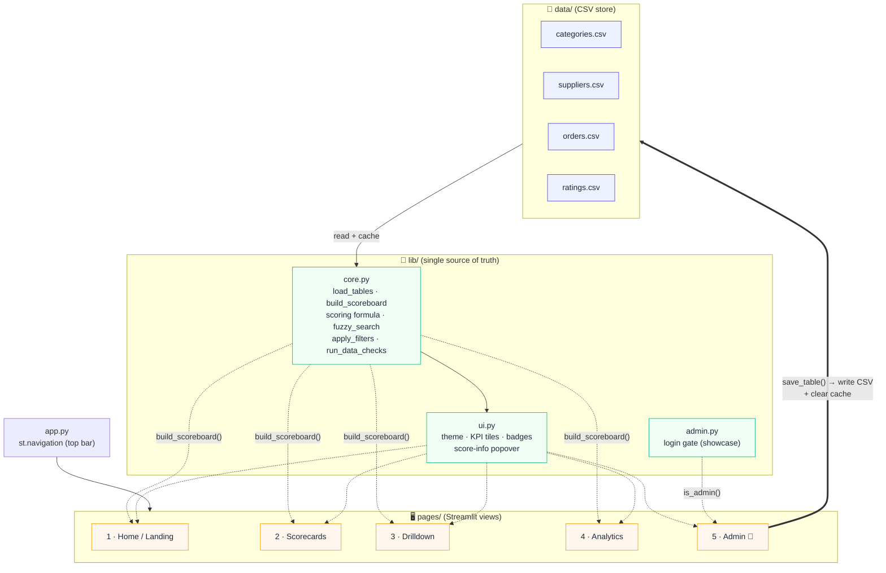

# High-level project overview

The Supplier Scorecard is a multipage **Streamlit** app that evaluates suppliers
from four CSV tables. All scoring logic lives in `lib/core.py` (single source of
truth); the pages under `pages/` are thin views that read the scored board and
render it. Admin edits write back to the CSVs and clear the cache so every page
refreshes.

**Reading the diagram**

- **data/** holds the four source tables. They are the only persistent state.
- **lib/core.py** loads and caches them, then derives one scored row per supplier
  (`build_scoreboard`). Everything downstream reads that board.
- **pages/** render the board; only **Admin** writes back, via `save_table()`,
  which rewrites the CSV and clears the cache so the next rerun re-scores.
