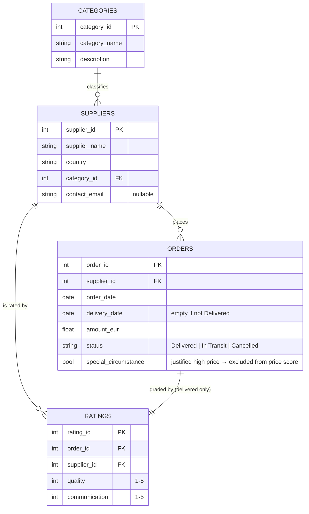

# Data structure

Four CSV tables under `data/`. They form a small relational model: every order
and rating points back to a supplier, every supplier to a category, and every
rating to the specific order it grades.

## What data goes where

| Table | One row per… | Key fields | Notes |
|-------|--------------|-----------|-------|
| `categories.csv` | product category | `category_id`, `category_name` | 6 categories (Electronics, Raw Materials, Machinery, Packaging, Logistics, Office Supplies). Price is scored **within** a category. |
| `suppliers.csv` | supplier | `supplier_id`, `country`, `category_id` (FK), `contact_email` | `contact_email` may be missing → flagged by integrity checks. |
| `orders.csv` | purchase order | `order_date`, `delivery_date`, `amount_eur`, `status`, `special_circumstance` | `status` drives everything: only **Delivered** orders feed the base score; **Cancelled** are excluded from spend and drive the penalty. |
| `ratings.csv` | rating of one **delivered** order | `quality`, `communication` (1–5) | Only delivered orders are rated (no rating for Cancelled/In-Transit). This is what makes the low-confidence flag meaningful. |

## Derived at load time (not stored)

`load_tables()` adds these to the in-memory `orders` frame; they are **stripped
before writing back** (`_DERIVED_COLS`) so they never leak into the CSV:

- `delivery_days = delivery_date − order_date` (NaN when not delivered)
- `special_circumstance` coerced from text/int to a real boolean

## Status semantics (the crux of the model)

| `status` | In `num_orders` | In `total_spend` | Feeds base score | Rated | Role |
|----------|:--------------:|:---------------:|:----------------:|:-----:|------|
| **Delivered** | ✅ | ✅ | ✅ delivery, price, quality, comm | ✅ | The only orders that build the base score |
| **In Transit** | ✅ | ✅ (money committed) | ❌ (nothing delivered yet) | ❌ | Counts as committed spend only |
| **Cancelled** | ✅ | ❌ (never paid) | ❌ | ❌ | Drives the reliability penalty |
