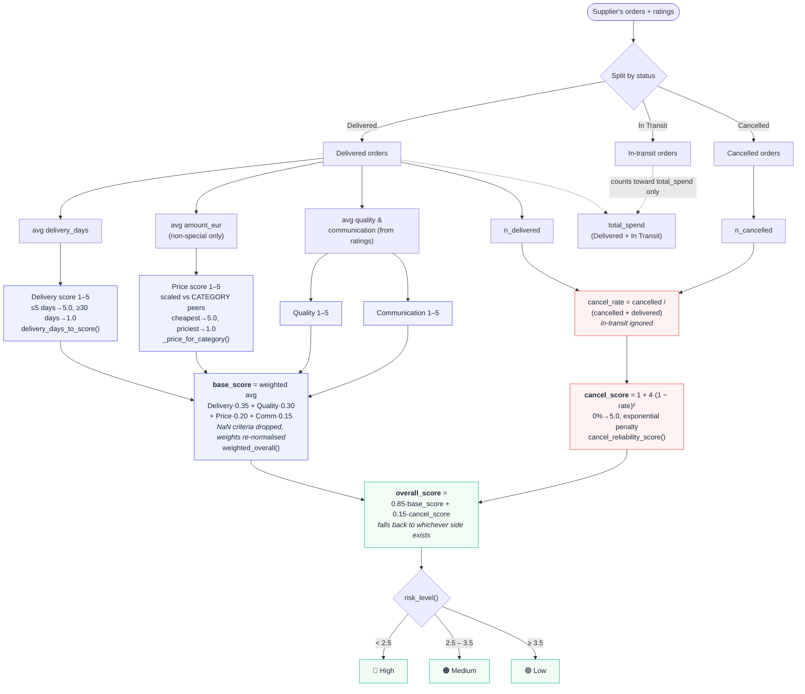

# Scoring calculation

How one supplier's **overall score (1–5)** is computed in `build_scoreboard()`
(`lib/core.py`). The overall is a **base score** (four criteria, delivered orders
only) blended with a **reliability score** that punishes cancellations.



## The formula

```
base_score = 0.35·Delivery + 0.30·Quality + 0.20·Price + 0.15·Communication
             (delivered orders only; any NaN criterion is dropped and the
              remaining weights are re-normalised to sum to 1.0)

cancel_rate  = n_cancelled / (n_cancelled + n_delivered)
cancel_score = 1 + 4·(1 − cancel_rate)²          # exponential, 1–5

overall_score = 0.85·base_score + 0.15·cancel_score
```

**Effective weight of each component in the overall** (what the drilldown tiles
show): the four base criteria share the 85% base, reliability takes 15%.

| Component | Base weight | Effective weight in overall |
|-----------|:-----------:|:---------------------------:|
| Delivery Time | 0.35 | 0.2975 (~30%) |
| Quality | 0.30 | 0.2550 (~26%) |
| Price | 0.20 | 0.1700 (17%) |
| Communication | 0.15 | 0.1275 (~13%) |
| **Reliability** | — | **0.1500 (15%)** |

## Edge cases (handled in the blend)

- **No delivered orders** → `base_score` is NaN → overall falls back to
  `cancel_score` (a supplier that only ever cancelled scores 1.0, High risk).
- **No resolved orders** (nothing delivered or cancelled) → `cancel_score` is
  NaN → overall falls back to `base_score`.
- **Special-circumstance orders** → excluded from the price average (a justified
  high price shouldn't lower the price score), but still count as delivered.
- **< 3 rated (delivered) orders** → `low_confidence = True`; the score is still
  shown but flagged.

## Where the same math is reused

`lib/core.py` is the single source of truth. The **Drilldown trend chart**
recomputes the quarterly score with the *same* helpers
(`delivery_days_to_score`, `_linear_score`, `cancel_reliability_score`,
`weighted_overall`) and the category price anchors from the board, so the trend
line reconciles with the headline score.
