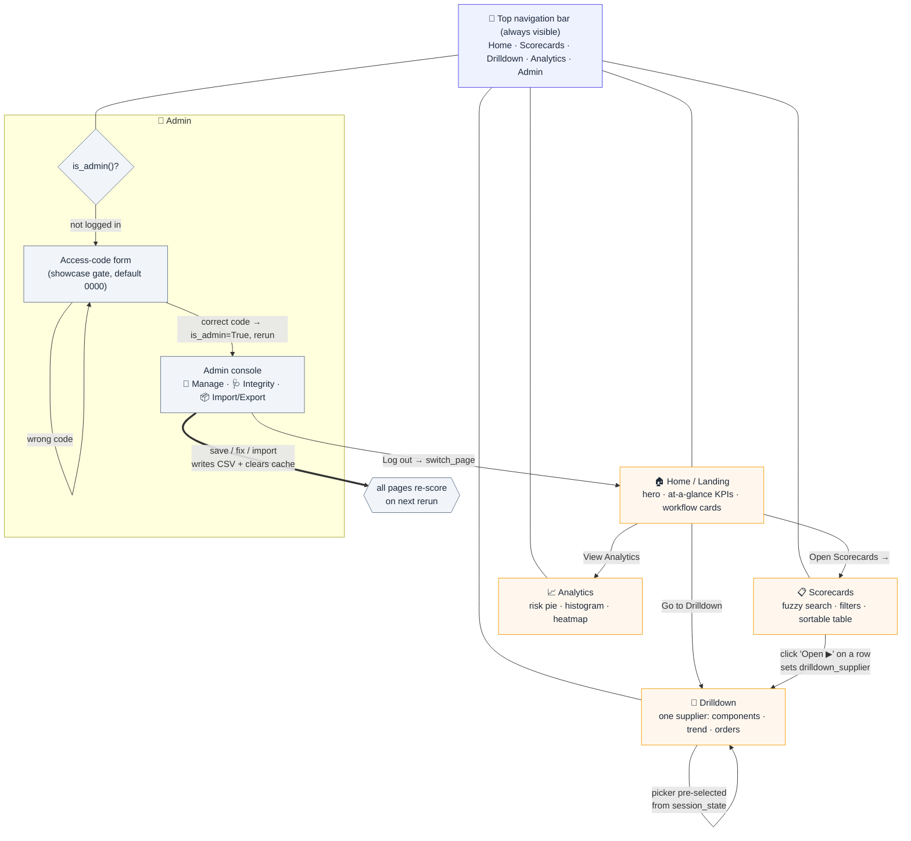

# Website / navigation flow

The app uses `st.navigation(position="top")` — a persistent top nav bar on every
page. Buttons and the Scorecards "Open" action jump between pages via
`st.switch_page()`; some jumps carry state through `st.session_state`.

## Page-by-page

| Page | Purpose | Key interactions |
|------|---------|------------------|
| **Home** (`1_Landing.py`) | Entry point, portfolio KPIs, workflow overview | CTA buttons → Scorecards / Analytics / Drilldown |
| **Scorecards** (`2_Scorecards.py`) | The main working table: fuzzy search, filters, per-column sort | "Open ▶" button on a row sets `drilldown_supplier` and jumps to Drilldown |
| **Drilldown** (`3_Drilldown.py`) | Full profile of one supplier | Reads `drilldown_supplier` to pre-select; supplier picker with fuzzy search |
| **Analytics** (`4_Analytics.py`) | Portfolio charts (risk pie, score histogram, category × criterion heatmap) | Filters react across all charts |
| **Admin** (`5_Admin.py`) | Role-gated data management | Login gate → edit/save, integrity checks + one-click fixes, bulk import/export |

## State passed between pages

- **`drilldown_supplier`** — set by the Scorecards "Open" button, consumed
  (`.pop`) by Drilldown to pre-select the supplier.
- **`is_admin`** — session flag flipped by the Admin login form; every Admin
  render checks `is_admin()` before showing anything.
- **Cache invalidation** — any Admin write calls `save_table()`, which clears the
  `load_tables` / `build_scoreboard` caches, so all pages recompute on the next
  rerun.
